

# Getting started with Digital-to-Analog Converter (DAC)

This repository contains examples of bare metal source code for DAC as described in [*TB3235 - Using 10-Bit DAC for Generating Analog Signals*](https://www.microchip.com/wwwappnotes/appnotes.aspx?appnote=en1001655) document from Microchip. The repository contains an Atmel Studio Solution (*AVR-DA128_DAC_Examples.atsln*) with four projects inside, one project for each illustrated use case.

Use cases:
1. Generating Constant Analog Signal Using 10-Bit DAC (*Generating_Constant_Signal_Example* project)
 - *Use case description:* Initialize the DAC, set the 2.048V internal voltage reference for the DAC peripheral, set the DAC to output a specific constant voltage.
 - *Result:* A 1.2V constant analog signal will be available on the DAC output external pin (PD6).

2. Generating Sine Wave Signal Using 10-Bit DAC (*Generating_Sine_Wave_Signal_Example* project)
 - *Use case description:* Initialize the DAC, set the 2.048V internal voltage reference for the DAC peripheral, set the DAC to output in a loop the samples of a sine wave.
 - *Result:* A 100Hz sine wave will be available on the DAC output external pin (PD6).

3. Reading the DAC Internally with the ADC (*Reading_DAC_with_ADC_Example* project)
 - *Use case description:* Initialize the DAC and ADC, set the DAC peripheral as input for the ADC, set the 2.048V internal voltage reference for the DAC and ADC peripherals, increment the DAC output and read it with the ADC for each step.
 - *Result:* The value read by the ADC will modify according to the changes of the DAC input value.

4. Generating Amplitude Modulated Signal Using 10-Bit DAC (*Generate_Amplitude_Modulated_Signal_Example* project)
 - *Use case description:* Initialize the DAC with external voltage reference and link the signal that must be modulated to the external reference pin (PD7). The AVR core will continuously change the Data (DACn.DATA) register to create a modulated signal.
 - *Result:* The resulting modulated signal will be available on the DAC output external pin (PD6).

## Related Documentation
More details and code examples on the AVR128DA48 can be found at the following links:
- [TB3235 - Using 10-Bit DAC for Generating Analog Signals](https://www.microchip.com/wwwappnotes/appnotes.aspx?appnote=en1001655)
- [AVR128DA48 Product Page](https://www.microchip.com/wwwproducts/en/AVR128DA48)
- [AVR128DA48 Code Examples on GitHub](https://github.com/microchip-pic-avr-examples?q=avr128da48)
- [AVR128DA48 Project Examples in START](https://start.atmel.com/#examples/AVR128DA48CuriosityNano)

## Software Used
- Microchip Studio 7.0.2397 or newer [(Microchip Studio for AVR® and SAM Devices)](https://www.microchip.com/en-us/development-tools-tools-and-software/microchip-studio-for-avr-and-sam-devices)
- AVR-Dx 1.0.18 or newer Device Pack

## Hardware Used
- AVR128DA48 Curiosity Nano [(DM164151)](https://www.microchip.com/Developmenttools/ProductDetails/DM164151)

## Setup for Use Case #1
**Generating Constant Analog Signal Using 10-Bit DAC**

The AVR128DA48 Curiosity Nano Development Board is used as test platform.
 

 The following configurations must be made for this project:

 VREF:
  - Select the 2.048V internal voltage reference for the DAC peripheral
  - Set the Voltage Reference in Always On mode

 DAC0:
 - Enable DAC
 - Enable the output buffer
 - Enable Run in Standby mode
 - Disable digital input buffer and the pull-up resistor for the DAC output external pin (PD6)

## Operation for Use Case #1
**Generating Constant Analog Signal Using 10-Bit DAC**
1. Connect the board to the PC.

2. Open the *AVR-DA128_DAC_Examples.atsln* solution in Atmel Studio

3. Set *Generating_Constant_Signal_Example* project as StartUp project:
 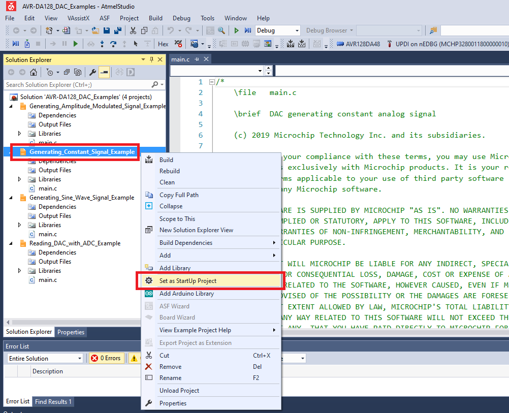

4. Build the *Generating_Constant_Signal_Example* project: right click on *Generating_Constant_Signal_Example* and select Build
 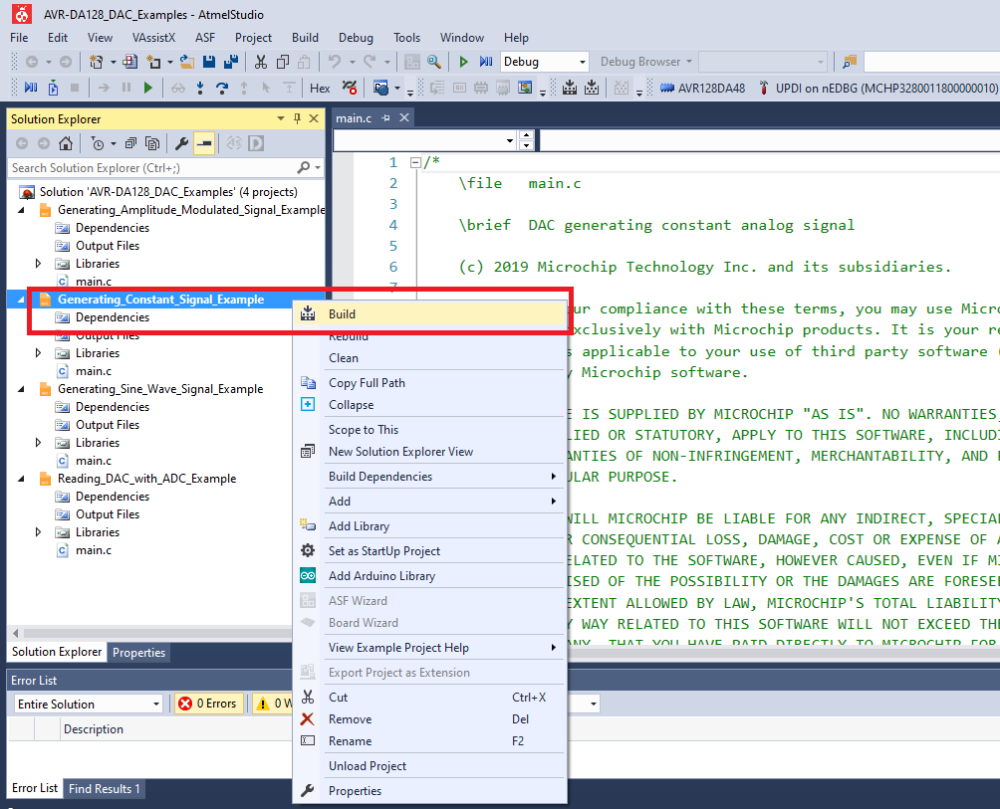

5. Select the AVR128DA48 Curiosity Nano on-board debugger in the *Tool* section of the *AVR-Dx_Bootloader* project settings:
  - Right click on the project and click *Properties*;
  - Click *Tool* tab on the left panel, select the corresponding debugger and save the configuration (Ctrl + S)
 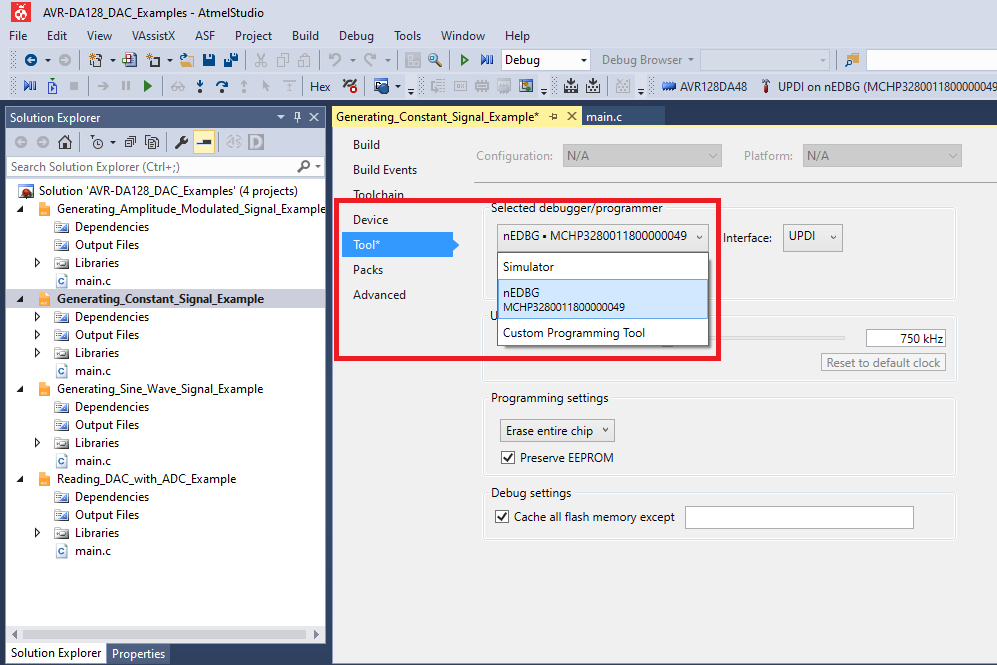

6. Program *Generating_Constant_Signal_Example* project to the board: select *Generating_Constant_Signal_Example* project and click *Start Without Debugging*:
 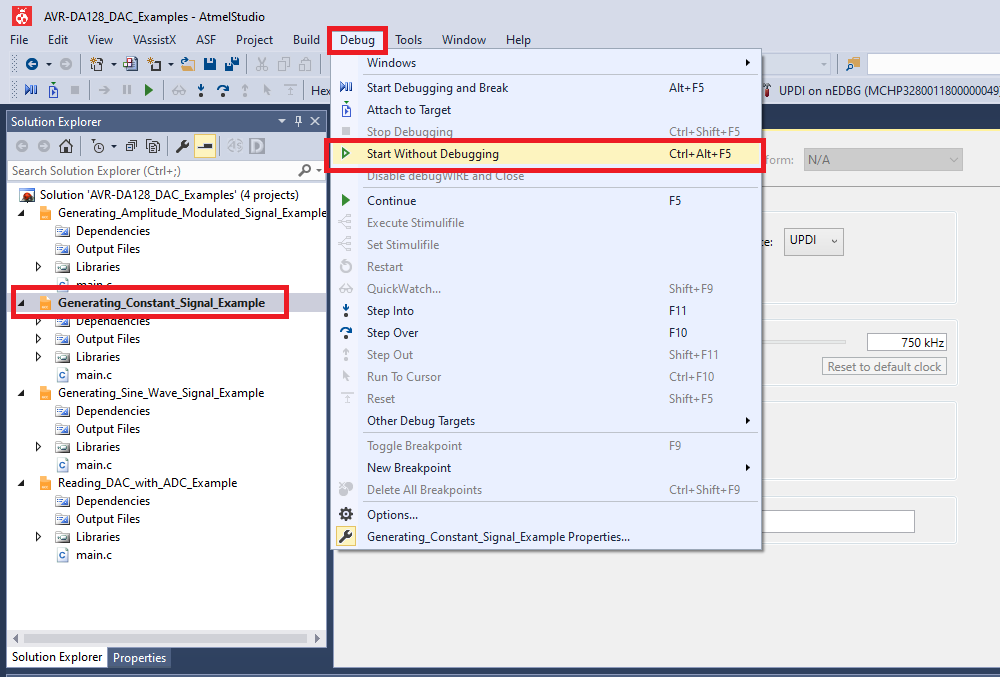

 **Results**
 PD6 - Constant analog signal (1.2V) on Channel 0 (black) below
 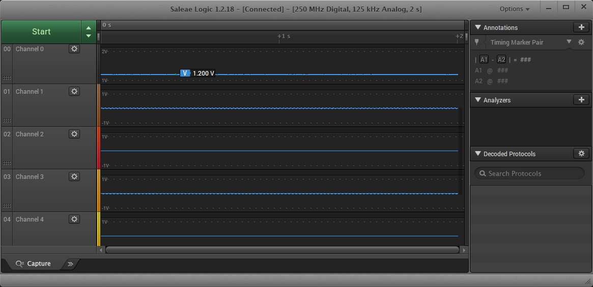

## Setup for Use Case #2

**Generating Sine Wave Signal Using 10-Bit DAC**

The AVR128DA48 Curiosity Nano Development Board is used as test platform.
 

 The following configurations must be made for this project:

 VREF:
  - Select the 2.048V internal voltage reference for the DAC peripheral
  - Set the Voltage Reference in Always On mode

 DAC0:
 - Enable DAC
 - Enable the output buffer
 - Enable Run in Standby mode
 - Disable digital input buffer and the pull-up resistor for the DAC output external pin (PD6)

## Operation for Use Case #2
**Generating Sine Wave Signal Using 10-Bit DAC**
1. Connect the board to the PC.

2. Open the *AVR-DA128_DAC_Examples.atsln* solution in Atmel Studio

3. Set *Generating_Sine_Wave_Signal_Example* project as StartUp project:
 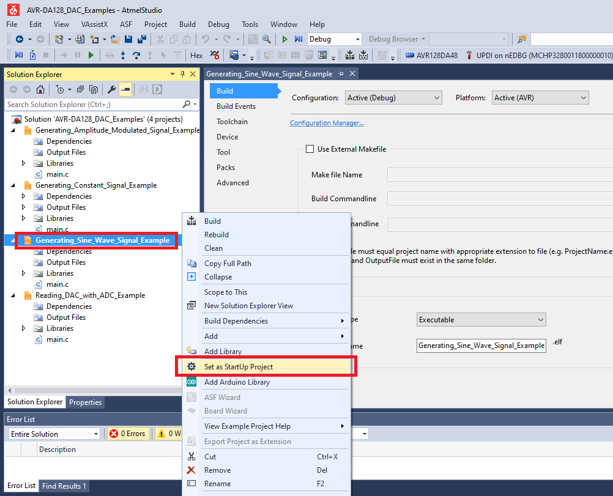

4. Build the *Generating_Sine_Wave_Signal_Example* project: right click on *Generating_Sine_Wave_Signal_Example* and select Build
 

5. Select the AVR128DA48 Curiosity Nano on-board debugger in the *Tool* section of the *Generating_Sine_Wave_Signal_Example* project settings:
  - Right click on the project and click *Properties*;
  - Click *Tool* tab on the left panel, select the corresponding debugger and save the configuration (Ctrl + S)
 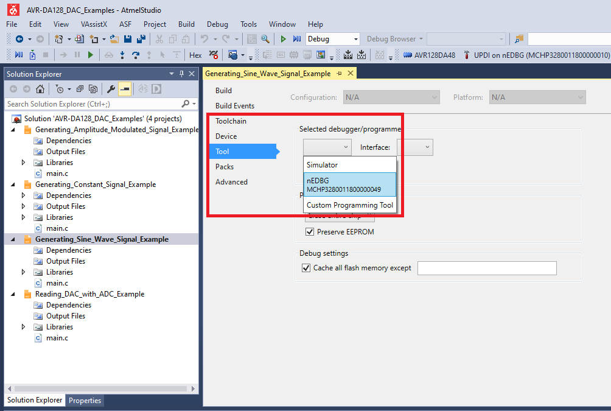

6. Program *Generating_Sine_Wave_Signal_Example* project to the board: select *Generating_Sine_Wave_Signal_Example* project and click *Start Without Debugging*:
 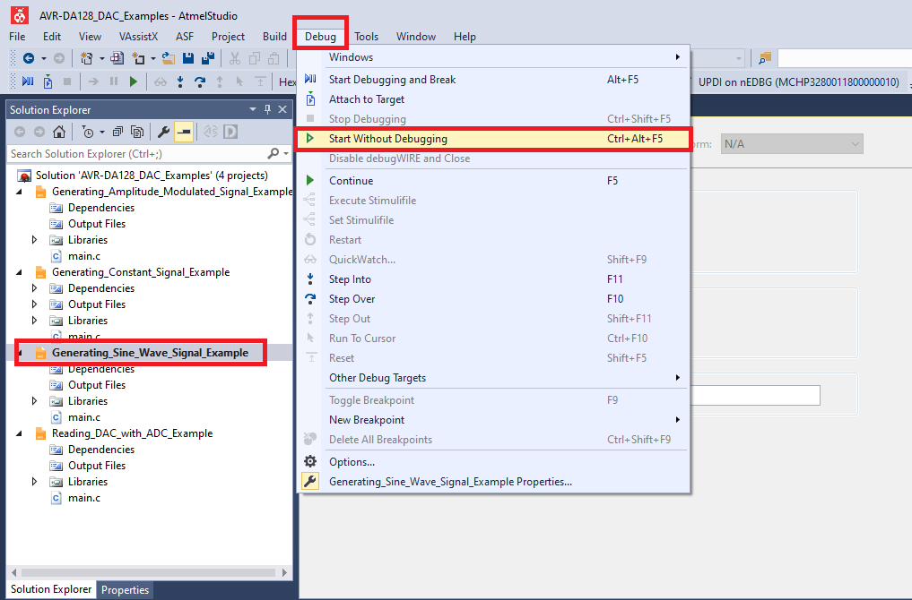

 **Results**
 PD6 - Sine wave on Channel 0 (black) below
 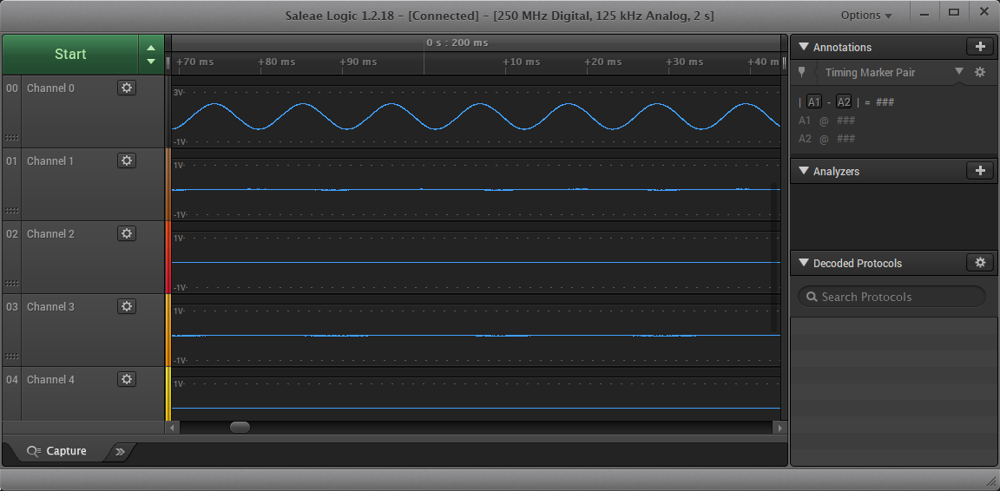

## Setup for Use Case #3

**Reading the DAC Internally with the ADC**

The AVR128DA48 Curiosity Nano Development Board is used as test platform.
 

 The following configurations must be made for this project:

 VREF:
  - Select the 2.048V internal voltage reference for the DAC peripheral
  - Select the 2.048V internal voltage reference for the ADC peripheral
  - Set the Voltage References in Always On mode

 DAC0:
 - Enable DAC

 ADC0:
 - Enable ADC
 - Select 12-bit resolution
 - Select DIV2 prescaler
 - Set the DAC peripheral as input for the ADC

## Operation for Use Case #3
**Reading the DAC Internally with the ADC**
1. Connect the board to the PC.

2. Open the *AVR-DA128_DAC_Examples.atsln* solution in Atmel Studio

3. Set *Reading_DAC_with_ADC_Example* project as StartUp project:
 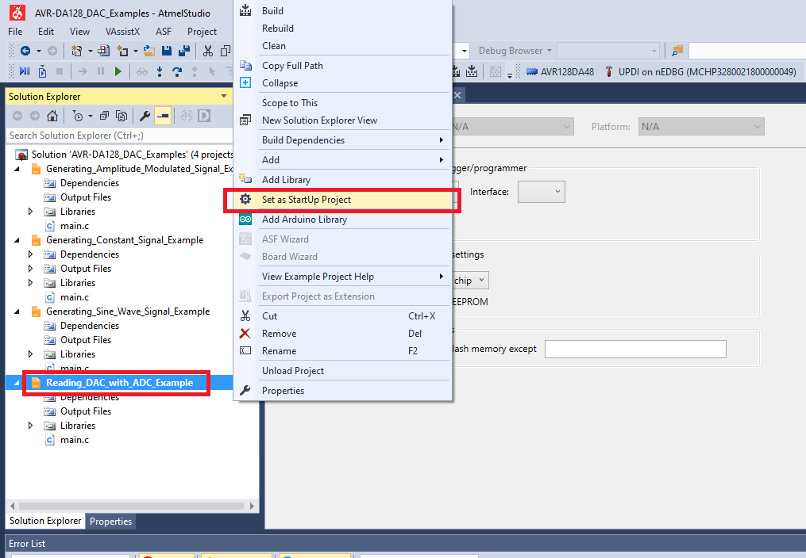

4. Build the *Reading_DAC_with_ADC_Example* project: right click on *Reading_DAC_with_ADC_Example* and select Build
 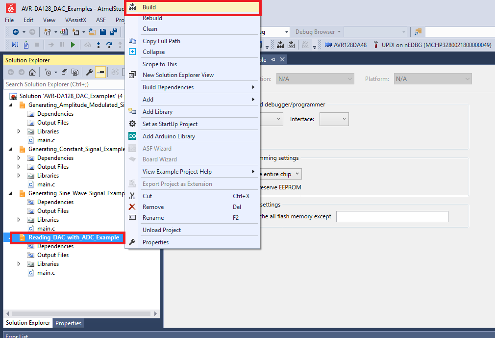

5. Select the AVR128DA48 Curiosity Nano on-board debugger in the *Tool* section of the *Reading_DAC_with_ADC_Example* project settings:
  - Right click on the project and click *Properties*;
  - Click *Tool* tab on the left panel, select the corresponding debugger and save the configuration (Ctrl + S)
 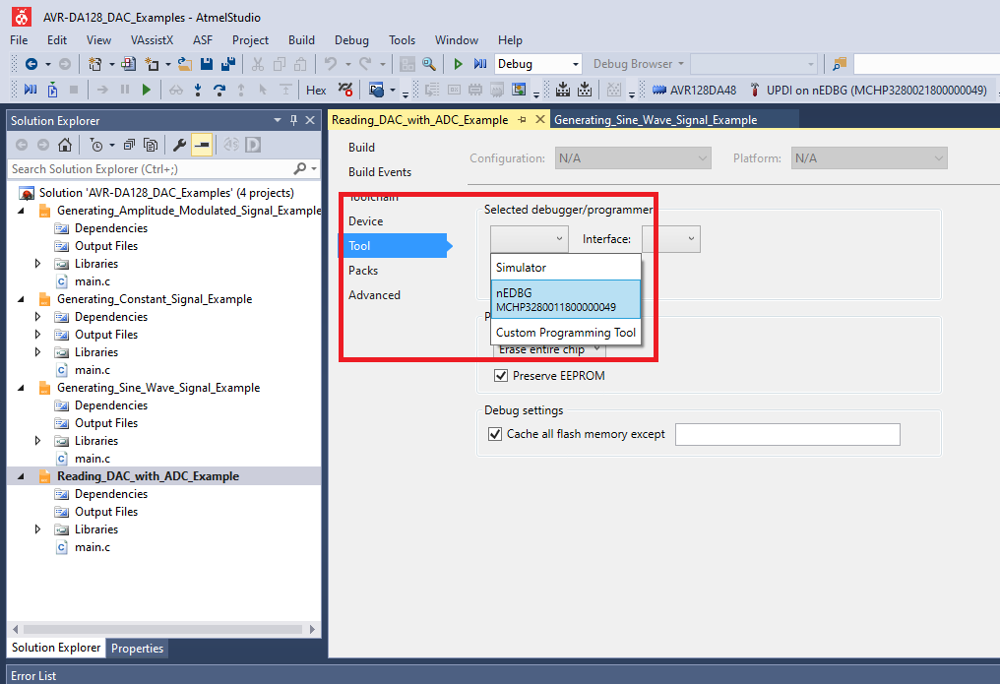

6. Program *Reading_DAC_with_ADC_Example* project to the board: select *Reading_DAC_with_ADC_Example* project and click *Start Without Debugging*:
 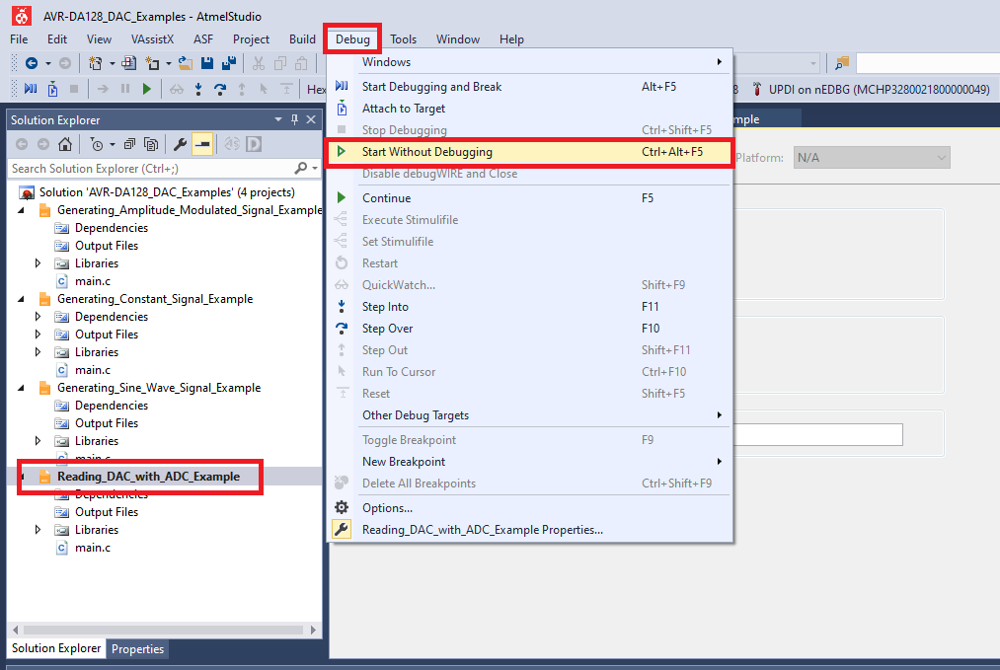

 **Results**
 Theoretical results for dacVal = 100
 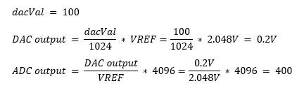
 Practical results for dacVal = 100 using Debug Mode
 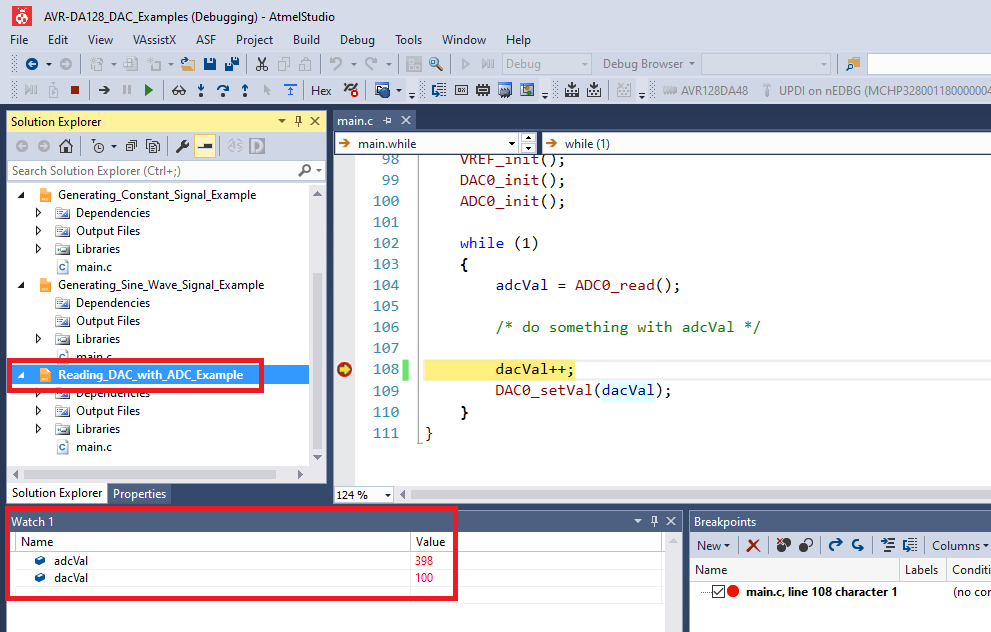

## Setup for Use Case #4

**Generating Amplitude Modulated Signal Using 10-Bit DAC**

The AVR128DA48 Curiosity Nano Development Board is used as test platform.
 

 The following configurations must be made for this project:

 VREF:
  - Select the external voltage reference on VREFA pin (PD7) for the DAC peripheral
  - Set the Voltage Reference in Always On mode

 DAC0:
 - Enable DAC
 - Enable the output buffer
 - Enable Run in Standby mode
 - Disable digital input buffer and the pull-up resistor for the DAC output external pin (PD6)

|Pin           | Configuration      |
| :----------: | :----------------: |
|PD7 (VREFA)   | Analog Input       |

## Operation for Use Case #4
**Generating Amplitude Modulated Signal Using 10-Bit DAC**
1. Connect the board to the PC.

2. Open the *AVR-DA128_DAC_Examples.atsln* solution in Atmel Studio

3. Set *Generate_Amplitude_Modulated_Signal_Example* project as StartUp project:
 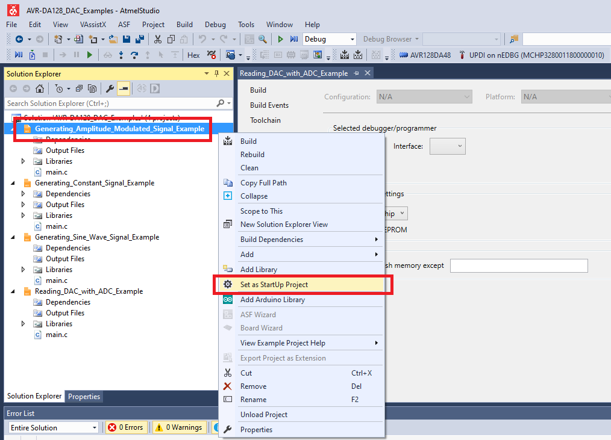

4. Build the *Generate_Amplitude_Modulated_Signal_Example* project: right click on *Generate_Amplitude_Modulated_Signal_Example* and select Build
 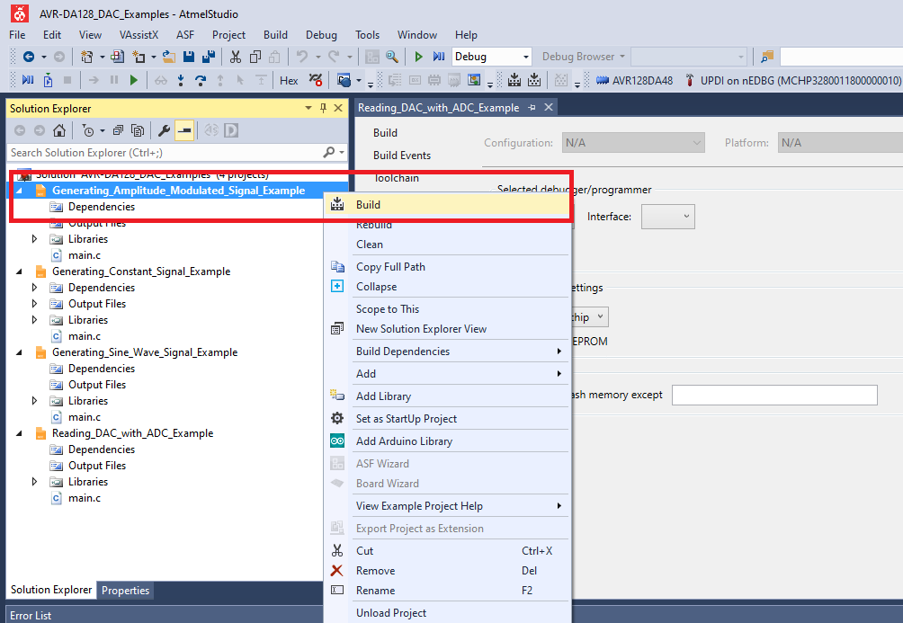

5. Select the AVR128DA48 Curiosity Nano on-board debugger in the *Tool* section of the *Generate_Amplitude_Modulated_Signal_Example* project settings:
  - Right click on the project and click *Properties*;
  - Click *Tool* tab on the left panel, select the corresponding debugger and save the configuration (Ctrl + S)
 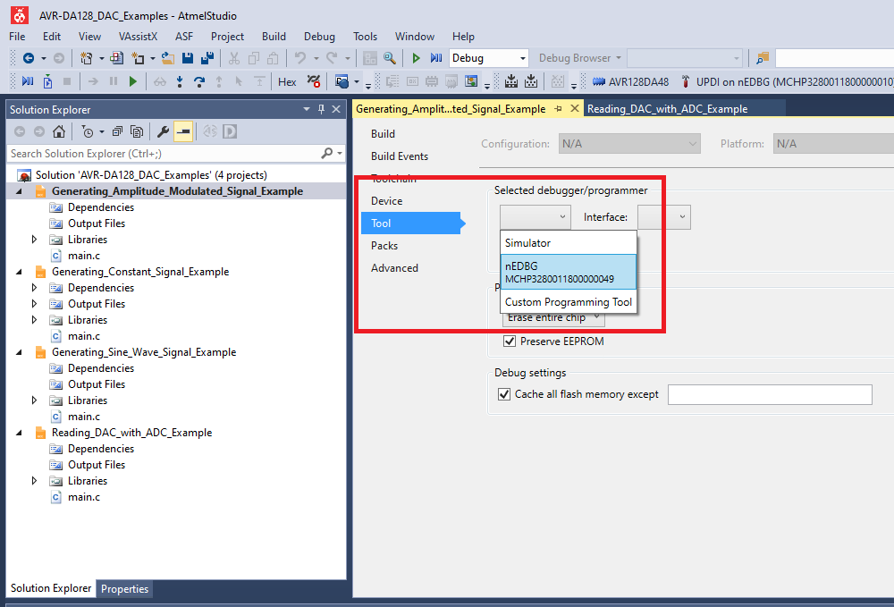

6. Program *Generate_Amplitude_Modulated_Signal_Example* project to the board: select *Generate_Amplitude_Modulated_Signal_Example* project and click *Start Without Debugging*:
 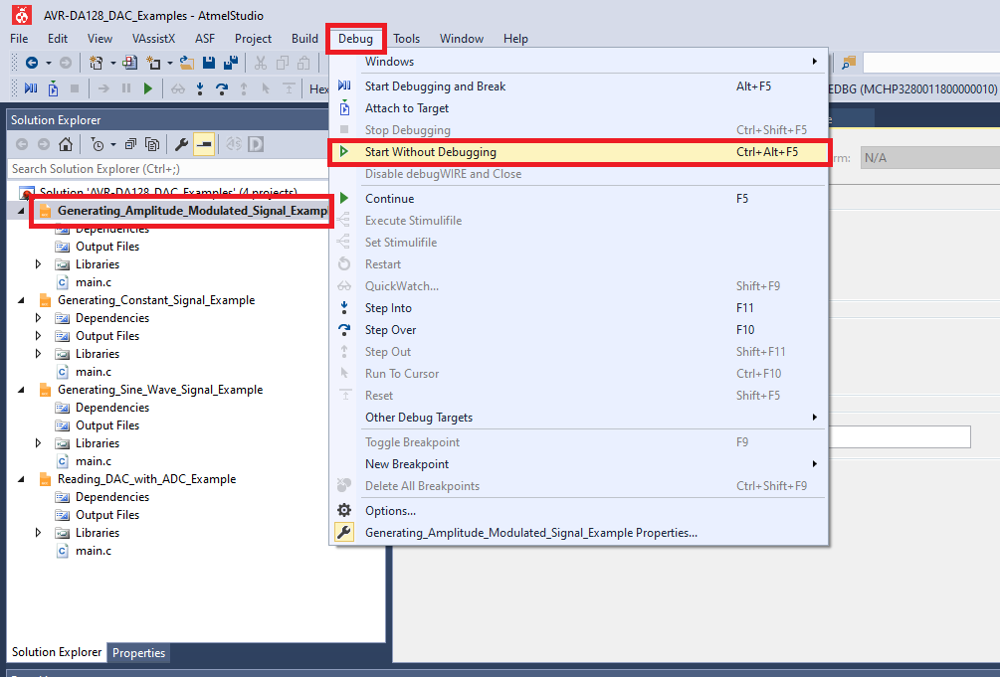

 **Results**
 External Analog Signal (information signal) on VREFA (PD7) pin - Channel 1 (orange) in the screenshot below
 Amplitude Modulated Signal on PD6 - Channel 2 (blue) in the screenshots below

 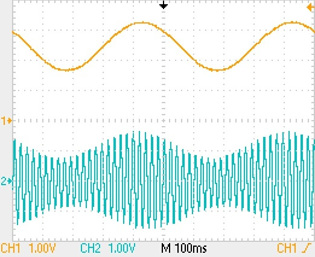

 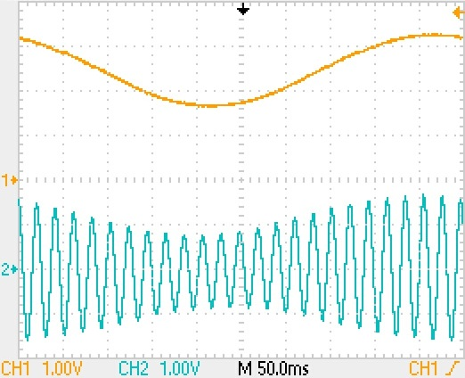

## Summary
The [*TB3235 - Using 10-Bit DAC for Generating Analog Signals*](https://www.microchip.com/wwwappnotes/appnotes.aspx?appnote=en1001655) document provides four use cases for generating analog signals using the 10-bit DAC.
